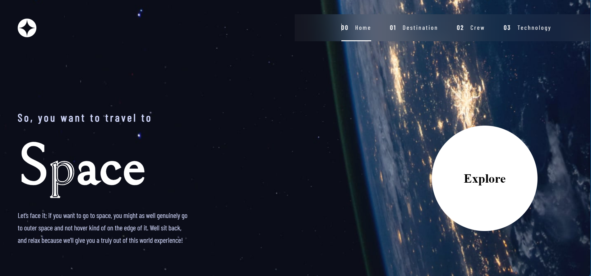

# SPACE TOURISM PROJECT

## Description

This is a project that showcases a space tourism website. The website is built using HTML, SCSS, and JavaScript. The website is responsive and works on all devices.

## Technologies

-   HTML
-   SCSS
-   JavaScript

## Setup

1. Clone this repository to your local machine.
2. Run `npm install` to install the necessary dependencies.
3. Open the `dist/index.html` file in your browser.

## Demo

You can view the project live [here](https://space-tourism0.netlify.app).
